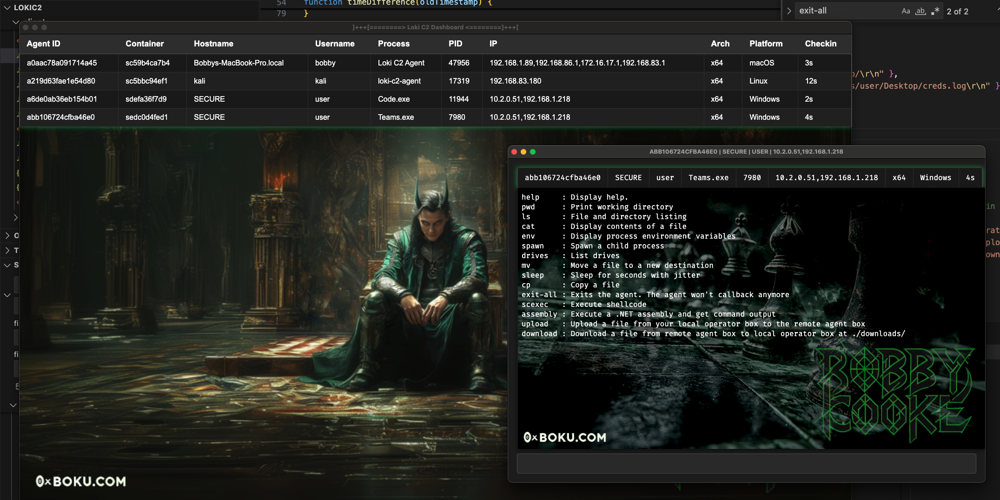
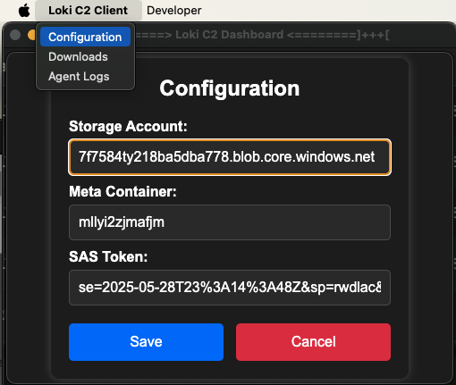

# 🧙‍♂️ Loki Command & Control
Stage 1 C2 for backdooring Electron applications to bypass application controls. This technique abuses the trust of signed vulnerable Electron applications to gain execution on a target system. 



## 🚀 Contributors

| Name                | Contributions                 |
|---------------------|-------------------------------|
| [Bobby Cooke](https://x.com/0xBoku)    | Creator & Maintainer |
| [Dylan Tran](https://x.com/d_tranman)  | Creator |
| [Ellis Springe](https://x.com/knavesec)| Alpha Tester |

## 🪄 Description
At runtime, an Electron application reads JavaScript files, interprets their code and executes them within the Electron process. The animation below demonstrates how the Microsoft Teams Electron application reads a JavaScript file at runtime, which then uses the Node.JS `child_process` module to execute `whoami.exe`.  


Since Electron applications execute JavaScript at runtime, modifying these JavaScript files allows attackers to inject arbitrary Node.js code into the Electron process. By leveraging Node.js and Chromium APIs, JavaScript code can interact with the operating system.

Loki was designed to backdoor Electron applications by replacing the applications JavaScript files with the Loki Command & Control JavaScript files.

For more information see my blog post about backdooring Electron applications with Loki C2:  

- [Bypassing Windows Defender Application Control with Loki C2](https://www.ibm.com/think/x-force/bypassing-windows-defender-application-control-loki-c2)

## Features & Details
- Uses Azure Storage Blobs for C2 channel.
  - All C2 messages are AES encrypted uaing a dynamically created AES key.
  - Uses SAS Token to protect C2 storage account.
- Proxy-aware agent.
  - Uses Chromium renderer child processes for agent, shellcode execution, and assembly fork-n-run style execution, so inherits proxy-aware capabilities of Chromium.
- Teamserver-less
  - Unlike traditional C2's where agents send messages to a Teamserver, there is no Teamserver.
  - The GUI client & agents both checkin to the same data-store for commands and output. 
- Hidden window and does not show in taskbar after execution, Loki process is ran in background.
  - Can stay alive for months calling back until the computer is restarted.
- Robust exception handling in kernel process, if agent child process dies from an exception or bug then kernel spawns a new agent process. 

### Commands
_All agent commands are written in native Node.JS and do not require additional dependecies or library load events. With the exception of the `scexec` and `assembly` commands which do a library load on `keytar.node` and `assembly.node`_
- All commands accept paths using `/`, `\` in paths will not work.

| Command     | Description                                                                |
|-------------|----------------------------------------------------------------------------|
| `help`      | Display help. Usage: `help` or `help scan`                                 |
| `pwd`       | Print working directory                                                    |
| `ls`        | File and directory listing                                                 |
| `cat`       | Display contents of a file                                                 |
| `env`       | Display process environment variables                                      |
| `spawn`     | Spawn a child process                                                      |
| `drives`    | List drives                                                                |
| `mv`        | Move a file to a new destination                                           |
| `sleep`     | Sleep for seconds with jitter                                              |
| `cp`        | Copy a source file to a destination                                        |
| `exit-all`  | Exits the agent, agent won't callback anymore                              |
| `load`      | Load a node PE file from disk into the process                             |
| `scexec`    | Execute shellcode                                                          |
| `assembly`  | Execute a .NET assembly and get command output                             |
| `upload`    | Upload a file from your local operator box to the remote agent box         |
| `download`  | Download a file from remote agent box to local operator box                |
| `scan`      | Perform TCP network scan across CIDR range with selected ports             |
| `dns`       | DNS lookup. Leverages systems DNS configuration                            |
| `set`       | Set the Node load paths for assembly node and scexec nodes                 |  

#### `Set` - Loading Nodes from Application Control Exclusion Paths
- If there are application control rules preventing library loads for the node files you can use the `set` command to change the load paths for `assembly.node` and `scexec.node`. 
- By using `ls`, `cat`, `cp` and `mv` you may be able to enumerate the application control rules to discover a writable directory that is an exclusion. 
- With this you can put the node files in the exclusion directory and use the `set` command to change their load path to the exclusion directory to bypass the application control. 
- For more details on this attack vector see the [CRTO2](https://training.zeropointsecurity.co.uk/courses/red-team-ops-ii) course by [Daniel Duggan (@_RastaMouse)](https://x.com/_RastaMouse) 

```
[04-04-2025 8:50AM MST] advsim$ help set
Set the Node load paths for assembly node and scexec nodes
	set scexec_path C:/Users/user/AppData/ExcludedApp/scexec.node
	set assembly_path C:/Users/user/AppData/ExcludedApp/assembly.node
[04-04-2025 8:51AM MST] advsim$ set scexec_path C:/Users/user/AppData/ExcludedApp/scexec.node
SCEXEC Node Load Path Set to : C:/Users/user/AppData/ExcludedApp/scexec.node
```

### Agent Features
[For more information on Agent features click here](docs/features/agent.md)

### Client Features
[For more information on Client features click here](docs/features/client.md)

## 🧙‍♂️ Deploy Illusions 
First you need to identify a vulnerable Electron application which does not do ASAR security integrity checks such as `Microsoft Teams`. Newer applications may have integrity checks preventing backdooring. Older versions of the target app are more likely to be vulnerable. 

- [Guide for Discovering Vulnerable Electron Apps](docs/vulnhunt/electronapps.md)

| Vulnerable | App Name       | EXE Name       | Version  | 
|------------|--------------|---------------|---------|
| ✅         | Microsoft Teams | `Teams.exe`         | v1.7.00.13456|
| ✅         | VS Code         | `code.exe`          | |
| ✅         | Github Desktop  | `GithubDesktop.exe` | |
| ❌         | 1Password       | `1Password.exe`     | |
| ❌         | Signal          | `Signal.exe`        | |
| ❌         | Slack           | `slack.exe`         | |

### Simple Instructions
_When backdooring an Electron app with Loki C2 code you don't need to compile the agent. You just replace the contents of `/resources/app/` with the agent JavaScript files._

### Detailed Instructions
#### Step 1 : Create Azure Storage Blob Account and get SAS Token
- [Create Azure Storage Account via Azure Portal](./docs/azure/create-storage-account-portal.md)
- [Create Azure Storage Account via Azure CLI](./docs/azure/create-storage-account-sas-azurecli.md)
#### Step 2 : Create Obfuscated Loki Payload
- Clone this repo and `cd` into it
- Install Node.JS
- Install `javascript-obfuscator` module
```
npm install --save-dev javascript-obfuscator
```
- Run `obfuscateAgent.js` script to create a Loki payload with your Storage Account info
```
bobby$ node obfuscateAgent.js 
[+] Provide Azure storage account information:
        - Enter Storage Account  : 7f7584ty218ba5dba778.blob.core.windows.net
        - Enter SAS Token        : se=2025-05-28T23%3A14%3A48Z&sp=rwdlac&spr=https&sv=2022-11-02&ss=b&srt=sco&sig=5MXQzJ6FDZK8yYiBSgJ6FDZKgQzJMXBSgg6qE4ydrJ6FDZKSgg%3D

[+] Configuration:
        - Storage Account : 7f7584ty218ba5dba778.blob.core.windows.net
        - SAS Token       : se=2025-05-28T23%3A14%3A48Z&sp=rwdlac&spr=https&sv=2022-11-02&ss=b&srt=sco&sig=5MXQzJ6FDZK8yYiBSgJ6FDZKgQzJMXBSgg6qE4ydrJ6FDZKSgg%3D
        - Meta Container  : mllyi2zjmafjm

[+] Updated /Users/bobby/apr2/LokiC2/config.js with storage configuration. 
 - Enter into the Loki Client UI
        Loki Client > Configuration

[+] Modifying PE binaries to have new hashes...
        - Payload assembly.node hash : e9d126407264821d3c2d324da0e2d1bc13cbc53e7c56340fe12b07f69b707f02
        - Payload keytar.node   hash : 292c14ffebd6cae3df99d9fbee525e29a5a704f076b82207eb3e650de45b075d

[+] Payload ready!
         - Obfuscated payload in the ./app directory
```
#### Step 3 : Backdoor Electron Application
- Your obfuscated Loki payload is output to `./app/`
- Change directory to the `{ELECTRONAPP}/resources/`  
- Delete everything
- Copy the Loki `./app/` folder to `{ELECTRONAPP}/resources/app/`
- Click the Electron PE file and make sure Loki works

#### Step 4 : Configure Loki Client
- Launch the Loki GUI client
- From the menubar click `Loki Client > Configuration` to open the Settings window
- Enter in your Storage Account details and click `Save`
  
  
- The agent should now render in the dashboard
- Click the agent from the dashboard table to open the agent window
- Test to ensure Loki works properly

## Opsec Recommendations
- [Opsec Recommendations](docs/opsec/recommendations.md)

## Compilation Guides
These are the compile instructions for building the agents & clients. The instructions cover multiple platforms, including Windows, Linux, and macOS. It is recommended to compile the client on the target platform and architecture.

### Client
- [Windows](./docs/compile/client/windows.md)
- [macOS](./docs/compile/client/macos.md)

### Agents
**If you are backdooring an Electron application then you don't need to compile agents.**  

I do not recommend compiling the agent and using it for operations. Agent compile instructions are for development. 

- [Windows](./docs/compile/agent/windows.md)
- [Linux](./docs/compile/agent/linux.md)
- [macOS](./docs/compile/agent/macos.md)

## Detection Guidance
- Review the information provided by MITRE for more details, examples, and information about this TTP :
  -  [MITRE ATT&CK T1218.015: Electron Applications](https://attack.mitre.org/techniques/T1218/015/)
- Execution of an electron app from a abnormal directory such as `~/Downloads/Teams/Teams.exe`
- Electron apps beaconing to an Azure Storage Blob `*.blob.core.windows.net`
- SAS token usage in network traffic
- Electron apps spawning child processes such as `netstat.exe` or `whoami.exe`
- A directory with the name in the Loki `packages.json` will be created in `~/AppData/Roaming/{NAME}` when the Loki JavaScript executes in the Electron process.
- This [LOLBAS Teams](https://lolbas-project.github.io/lolbas/OtherMSBinaries/Teams/) entry covers detections for Electron application backdooring. The detection information has been copied below.  
- IOC: `%LOCALAPPDATA%\Microsoft\Teams\current\app` directory created
- IOC: `%LOCALAPPDATA%\Microsoft\Teams\current\app.asar` file created/modified by non-Teams installer/updater

# References & Acknowledgements
- [Dylan Tran (@d_tranman)](https://x.com/d_tranman)
  - Cocreator of the Loki agent. Created node modules for shellcode and assembly execution.  
- [Valentina Palmiotti (@chompie1337)](https://x.com/chompie1337), [Ellis Springe (@knavesec)](https://x.com/knavesec), and [Ruben Boonen](https://x.com/FuzzySec) for their previous internel work on backdooring Electron applications for persistence
- [Ruben Boonen](https://x.com/FuzzySec)
  - [ Wild West Hackin’ Fest talk Statikk Shiv: Leveraging Electron Applications for Post-Exploitation](https://www.youtube.com/watch?v=VXb6lwXhCAc)
- Andrew Kisliakov
  - [Microsoft Teams and other Electron Apps as LOLbins](https://l--k.uk/2022/01/16/microsoft-teams-and-other-electron-apps-as-lolbins/) 
- [mr.d0x (@mrd0x)](https://twitter.com/@mrd0x) for their prior work about leveraging the Teams Electron application to execute arbitrary Node.JS code and publishing their findings to the LOLBAS project.
- Michael Taggart
  - [quASAR project, a tool designed for modifying Electron applications to enable command execution](https://github.com/mttaggart/quasar)
  - [Quasar: Compromising Electron Apps](https://taggart-tech.com/quasar-electron/)
- [Raphael Mudge](https://bsky.app/profile/raphaelmudge.bsky.social) for inspiring me to dive deep into red teaming and supporting the release of this tool
  - [The Security Conversation](https://aff-wg.org/)

## License
This project is licensed under the Business Source License 1.1. Non-commercial use is permitted under the terms of the license. Commercial use requires the author's explicit permission. On April 3, 2030, this license will convert to Apache 2.0. See [LICENSE](./LICENSE) for full details.

